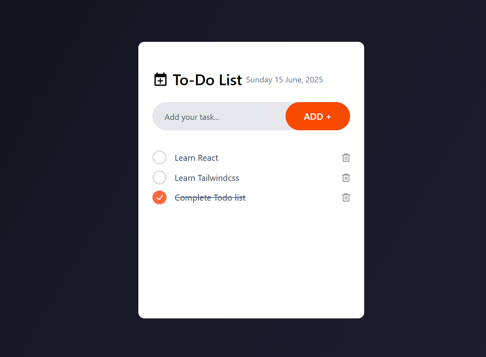

# Listlify React

A simple and modern To-Do List application built with **React**, **Vite**, and **Tailwind CSS**.  
[Check out the live app](https://listlify-app.netlify.app/)



## Features
- Add, complete, and delete tasks
- Tasks are persisted in local storage
- Responsive and clean UI

## Tech Stack

- React
- Tailwindcss
- Vite
- ESLint

## Getting Started

### Prerequisites

- [Node.js](https://nodejs.org/) (v16 or higher recommended)
- [npm](https://www.npmjs.com/)

### Installation

```sh
git clone https://github.com/Balaji-R-05/listlify-react.git
cd listlify-react
npm install
npm run dev
```