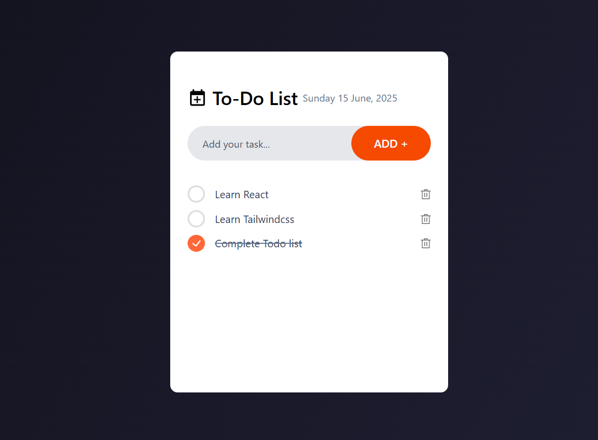

# 📋 Listlify React

A minimal, premium, and fully-responsive To-Do List application built with **React**, **Vite**, and **Tailwind CSS**. Designed to help you stay organized with a polished UI, smart sorting, and full keyboard accessibility.

[✨ Check out the live app](https://listlify-app.netlify.app)



## Features

- **Smart Task Sorting**: Unfinished tasks automatically stay at the top, while completed tasks elegantly sink to the bottom.
- **Inline Editing**: Double-click any task to quickly edit it inline without needing to delete and recreate.
- **Clear Completed**: A convenient batch-delete button dynamically appears to instantly clear out all finished tasks.
- **Local Storage Persistence**: Powered by a custom `useLocalStorage` React hook, ensuring your data is safely saved and persists across browser reloads.
- **Keyboard & A11y Support**: Includes `focus-visible` styling, screen reader labels, and fully standard `Enter`/`Tab` key navigation.
- **Lightning Fast**: Powered by Vite for near-instant development and build speeds.

## 🛠️ Tech Stack

- **Client Side**: [React 19](https://reactjs.org/)
- **Build Tool**: [Vite 6](https://vitejs.dev/)
- **Styling**: [Tailwind CSS v4](https://tailwindcss.com/)
- **Linting**: [ESLint](https://eslint.org/)

## 📂 Project Structure

```bash
src/
├── assets/                 # Static assets (images, icons)
├── components/             # Reusable React components
│   ├── Todo.jsx            # Main Todo list container and state logic
│   └── TodoItems.jsx       # Individual row UI and inline edit handling
├── hooks/
│   └── useLocalStorage.js  # Custom hook for localStorage syncing
├── App.jsx                 # Root application component
├── main.jsx                # Entry point
└── index.css               # Global styles and Tailwind directives
```

## 💻 Getting Started

Follow these instructions to set up the project on your local machine.

### Prerequisites
Ensure you have the following installed:
- [Node.js](https://nodejs.org/) (v18 or higher recommended)
- [npm](https://www.npmjs.com/) (comes with Node.js)

### Installation

1. **Clone the repository**
   ```sh
   git clone https://github.com/Balaji-R-05/listlify-react.git
   cd listlify-react
   ```

2. **Install dependencies**
   ```sh
   npm install
   ```

3. **Start the development server**
   ```sh
   npm run dev
   ```
   The app should now be running locally at `http://localhost:5173`.

---
*Built with ❤️ by Balaji*